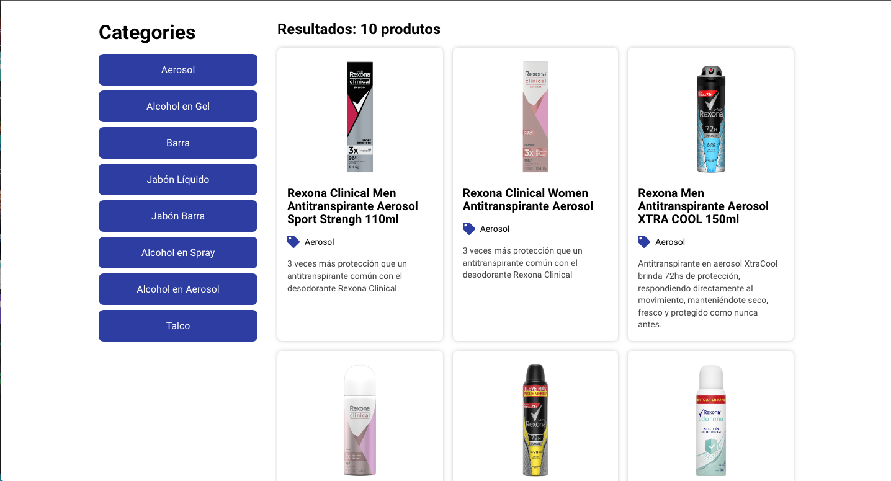

# tbb-challenge

## Project Description
<p align="center">Little challenge made for The Brooklyn Brothers Company job test.</p>



### Prerequisites
Before starting, you will need to have the following tools installed on your machine:
[Git](https://git-scm.com), [Node.js](https://nodejs.org/en/). 
Besides, it's good to have an editor to work with the code like [VSCode](https://code.visualstudio.com/)

### 🎲 Running the app
```bash
# Clone this repository
# Access the project folder in terminal/cmd

# Install dependencies
$ npm install
# ou
$ yarn

# Execute the app
$ yarn dev
```

### 🛠 Tecnologias
The following tools were used in building the project:

- [React](https://pt-br.reactjs.org/)
- [TypeScript](https://www.typescriptlang.org/)

### Author
---


Made by Lucas Lourenço 👋🏽
[](https://www.linkedin.com/in/lucaslourenco2802) 
[](mailto:lucascelestiano@gmail.com)
